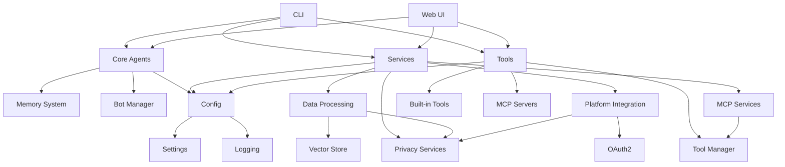

# Project Zohar - Modules Overview

This document provides a comprehensive overview of all modules and components implemented in Project Zohar.

## 📋 Table of Contents

- [Core Modules](#core-modules)
- [Service Modules](#service-modules)
- [Tool Modules](#tool-modules)
- [User Interface Modules](#user-interface-modules)
- [Configuration and Utilities](#configuration-and-utilities)
- [Development Tools](#development-tools)

## 🏗️ Core Modules

### 1. Agent System (`src/zohar/core/agents/`)

#### Personal Agent (`personal_agent.py`)
- **Purpose**: Handles private user data and personal interactions
- **Features**:
  - Private data access and processing
  - Email integration and analysis
  - Conversation memory management
  - Personalized responses based on user history
  - Privacy-aware data handling
- **Key Methods**:
  - `process_message()`: Process user messages with context
  - `analyze_email()`: Analyze and process email content
  - `get_suggestions()`: Generate action suggestions
  - `update_memory()`: Update conversation memory

#### Public Agent (`public_agent.py`)
- **Purpose**: Handles general queries without private data access
- **Features**:
  - General information queries
  - Web search capabilities
  - Public knowledge base access
  - No access to personal data
  - Stateless interactions for privacy
- **Key Methods**:
  - `process_query()`: Handle general information requests
  - `search_web()`: Perform web searches
  - `get_public_info()`: Access public knowledge

#### Bot Manager (`bot_manager.py`)
- **Purpose**: Orchestrates multiple agents and manages their lifecycle
- **Features**:
  - Agent lifecycle management
  - Multi-agent coordination
  - Resource allocation
  - Health monitoring
  - Agent communication routing
- **Key Methods**:
  - `get_personal_agent()`: Get or create personal agent
  - `get_public_agent()`: Get public agent instance
  - `route_message()`: Route messages to appropriate agents
  - `health_check()`: Monitor agent health

### 2. Memory System (`src/zohar/core/memory/`)

#### Conversation Memory (`conversation_memory.py`)
- **Purpose**: Manages conversation history and user preferences
- **Features**:
  - Persistent conversation storage using SQLite
  - User preferences management
  - Privacy-aware data retention
  - Conversation search and analysis
  - Data export/import capabilities
- **Key Components**:
  - `ConversationEntry`: Individual conversation records
  - `UserPreferences`: User-specific settings
  - `ConversationMemory`: Main memory management class
- **Database Schema**:
  - Conversations table with user messages and responses
  - User preferences with privacy settings
  - Indexes for efficient querying

## 🔧 Service Modules

### 1. Data Processing (`src/zohar/services/data_processing/`)

#### Data Processor (`processor.py`)
- **Purpose**: Comprehensive data processing for various file formats
- **Features**:
  - Multi-format file support (PDF, DOCX, CSV, JSON, etc.)
  - Content extraction and analysis
  - Document vectorization for semantic search
  - Batch processing capabilities
  - Privacy filtering integration
- **Supported Formats**:
  - Text: TXT, MD, HTML, XML
  - Documents: PDF, DOCX, DOC
  - Data: CSV, JSON, XLSX, XLS
  - Images: PNG, JPG (with OCR)
  - Email: EML, MSG

#### Vector Store (`vector_store.py`)
- **Purpose**: Vector storage and semantic search using ChromaDB
- **Features**:
  - Document embedding and storage
  - Semantic search capabilities
  - Batch processing for large datasets
  - Collection management
  - Export/import functionality
- **Key Methods**:
  - `add_documents()`: Add documents to vector store
  - `search()`: Perform semantic search
  - `get_similar_documents()`: Find similar content
  - `semantic_search_with_filters()`: Advanced filtering

### 2. Privacy Services (`src/zohar/services/privacy/`)

#### Privacy Filter (`privacy_filter.py`)
- **Purpose**: PII detection, data anonymization, and privacy protection
- **Features**:
  - Automatic PII detection (emails, phones, SSNs, etc.)
  - Multiple anonymization strategies
  - Privacy level enforcement
  - Custom pattern support
  - Compliance checking
- **Privacy Levels**:
  - Low: Basic protection
  - Medium: Moderate filtering
  - High: Strong PII detection
  - Maximum: No PII allowed
- **Anonymization Strategies**:
  - Redaction: Replace with [REDACTED]
  - Hashing: Replace with hash values
  - Substitution: Replace with fake data
  - Masking: Partial masking with asterisks

### 3. Platform Integration (`src/zohar/services/platform_integration/`)

#### Platform Manager (`platform_manager.py`)
- **Purpose**: Multi-platform API connections and OAuth2 authentication
- **Features**:
  - OAuth2 authentication flows
  - Multiple platform support
  - Rate limiting and error handling
  - Real-time data synchronization
  - Platform-specific adapters
- **Supported Platforms**:
  - Email: Gmail, Outlook, IMAP/SMTP
  - Chat: Slack, Discord, Telegram
  - Social: Twitter, LinkedIn
  - Productivity: Notion, Google Drive
- **Key Components**:
  - `PlatformAdapter`: Base adapter for API interactions
  - `PlatformConfig`: Platform configuration management
  - `PlatformCredentials`: Secure credential storage

### 4. MCP Services (`src/zohar/services/mcp_services/`)

#### MCP Manager (`mcp_manager.py`)
- **Purpose**: Model Context Protocol service management
- **Features**:
  - MCP server lifecycle management
  - Tool discovery and execution
  - Connection pooling
  - Health monitoring
  - Service configuration
- **Connection Types**:
  - WebSocket: Real-time communication
  - HTTP: REST API calls
  - STDIO: Process communication
  - Subprocess: Local server management
- **Built-in Servers**:
  - Filesystem: File operations
  - Git: Version control
  - Brave Search: Web search
  - SQLite: Database operations

## 🛠️ Tool Modules

### 1. Tool Manager (`src/zohar/tools/tool_manager.py`)

#### Unified Tool Management
- **Purpose**: Centralized tool registration and execution
- **Features**:
  - Built-in tool support
  - MCP server integration
  - Custom tool registration
  - Tool categorization
  - Execution monitoring
- **Tool Categories**:
  - System: Time, system info
  - File: Read, list, process
  - Communication: Notifications
  - Data: Calculations, analysis
  - Custom: User-defined tools

#### Built-in Tools
- **System Tools**:
  - `get_current_time`: Current date and time
  - `get_system_info`: System information
- **File Tools**:
  - `read_file`: Read file contents
  - `list_directory`: List directory contents
- **Communication Tools**:
  - `send_notification`: Send notifications
- **Data Tools**:
  - `calculate`: Mathematical calculations

### 2. Tool Categories (`src/zohar/tools/*/`)

#### Email Tools (`src/zohar/tools/email/`)
- Email processing and management
- IMAP/SMTP integration
- Email analysis and filtering

#### Browser Tools (`src/zohar/tools/browser/`)
- Web scraping capabilities
- Browser automation
- Search engine integration

#### System Tools (`src/zohar/tools/system/`)
- Operating system interactions
- File system operations
- Process management

#### MCP Servers (`src/zohar/tools/mcp_servers/`)
- MCP client implementation
- Server management utilities
- Custom server development

## 🖥️ User Interface Modules

### 1. Command Line Interface (`src/zohar/cli.py`)

#### Comprehensive CLI
- **Purpose**: Full-featured command-line interface
- **Features**:
  - Colored output with Rich library
  - Progress indicators
  - Command groups and subcommands
  - Configuration management
  - Interactive prompts
- **Command Groups**:
  - `setup`: System configuration
  - `agent`: Agent management
  - `data`: Data processing
  - `platform`: Platform integration
  - `ui`: Interface launching
  - `ollama`: LLM management

### 2. Web Interface (`src/zohar/ui/web/app.py`)

#### Modern Web Application
- **Purpose**: FastAPI-based web interface
- **Features**:
  - Real-time chat with WebSocket
  - File upload and processing
  - System monitoring dashboard
  - Settings management
  - Mobile-responsive design
- **API Endpoints**:
  - `/api/chat`: Chat with agents
  - `/api/status`: System status
  - `/api/settings`: Configuration
  - `/api/upload`: File processing
  - `/api/platforms`: Platform management
  - `/ws/{user_id}`: WebSocket chat

### 3. Setup Wizard (`scripts/setup_wizard.py`)

#### Interactive Configuration
- **Purpose**: Guided system setup and configuration
- **Features**:
  - System requirements checking
  - Dependency installation
  - LLM configuration (Ollama, OpenAI, etc.)
  - Privacy settings
  - Platform connections
  - MCP server setup
- **Setup Steps**:
  1. Requirements validation
  2. Directory structure creation
  3. Dependency installation
  4. LLM provider configuration
  5. Privacy level selection
  6. Platform integration
  7. MCP server configuration
  8. Configuration saving
  9. Installation testing

## ⚙️ Configuration and Utilities

### 1. Settings Management (`src/zohar/config/settings.py`)

#### Pydantic Configuration
- **Purpose**: Centralized configuration management
- **Features**:
  - Environment variable support
  - Type validation with Pydantic
  - Hierarchical configuration
  - Default value management
  - Configuration validation
- **Configuration Sections**:
  - LLM settings (provider, model, API keys)
  - Database configuration
  - Privacy settings
  - Platform credentials
  - UI preferences
  - Logging configuration

### 2. Logging System (`src/zohar/utils/logging.py`)

#### Comprehensive Logging
- **Purpose**: Structured logging with multiple outputs
- **Features**:
  - Colored console output
  - Multiple log files by category
  - Log rotation and management
  - Performance monitoring
  - Error tracking
- **Log Categories**:
  - Main application logs
  - Agent-specific logs
  - Platform integration logs
  - Data processing logs
  - Error logs

### 3. Package Structure (`src/zohar/__init__.py`)

#### Module Initialization
- **Purpose**: Package-level initialization and exports
- **Features**:
  - Version management
  - Module imports
  - Package metadata
  - Dependency checking

## 🔨 Development Tools

### 1. Makefile

#### Comprehensive Build System
- **Purpose**: Unified development and deployment commands
- **Features**:
  - 60+ make targets
  - Development environment setup
  - Testing and quality assurance
  - Deployment automation
  - Documentation generation
- **Key Targets**:
  - `install`: Basic installation
  - `dev-install`: Development setup
  - `test`: Run test suite
  - `lint`: Code quality checks
  - `format`: Code formatting
  - `docker-build`: Container building

### 2. Project Configuration (`pyproject.toml`)

#### Modern Python Project
- **Purpose**: Python project configuration and metadata
- **Features**:
  - Build system configuration
  - Dependency management
  - Tool configurations (black, isort, pytest)
  - Project metadata
  - Entry points definition
- **Dependencies**:
  - Core: FastAPI, Camel-AI, ChromaDB
  - UI: Rich, Typer, Gradio
  - AI: Sentence-transformers, Ollama
  - Development: Pytest, Black, MyPy

### 3. GitHub Integration (`.github/workflows/`)

#### CI/CD Pipeline
- **Purpose**: Automated testing and deployment
- **Features**:
  - Automated testing on multiple Python versions
  - Code quality checks
  - Security scanning
  - Documentation deployment
  - Release automation

## 📊 Module Dependencies



## 🚀 Deployment Architecture

### Local Deployment
```
┌─────────────────┐
│   Web Browser   │
└─────────┬───────┘
          │ HTTP/WebSocket
┌─────────▼───────┐
│   FastAPI Web   │
│    Interface    │
└─────────┬───────┘
          │
┌─────────▼───────┐
│  Project Zohar  │
│   Core System   │
├─────────────────┤
│ • Personal Agent│
│ • Public Agent  │
│ • Memory System │
│ • Data Processor│
│ • Privacy Filter│
│ • Tool Manager  │
└─────────┬───────┘
          │
┌─────────▼───────┐
│  Local Services │
├─────────────────┤
│ • Ollama LLM    │
│ • ChromaDB      │
│ • SQLite        │
│ • MCP Servers   │
└─────────────────┘
```

### Enterprise Deployment
```
┌─────────────────┐  ┌─────────────────┐
│   Load Balancer │  │  Reverse Proxy  │
└─────────┬───────┘  └─────────┬───────┘
          │                    │
┌─────────▼───────┐  ┌─────────▼───────┐
│  Web Interface  │  │  API Gateway    │
│    (Multiple)   │  │                 │
└─────────┬───────┘  └─────────┬───────┘
          │                    │
          └─────────┬──────────┘
                    │
┌─────────▼───────┐
│  Project Zohar  │
│   Cluster       │
├─────────────────┤
│ • Agent Pool    │
│ • Shared Memory │
│ • Data Pipeline │
│ • Privacy Layer │
└─────────┬───────┘
          │
┌─────────▼───────┐
│ Distributed DB  │
├─────────────────┤
│ • Vector Store  │
│ • Document DB   │
│ • Cache Layer   │
│ • Backup System │
└─────────────────┘
```

## 📈 Performance Characteristics

### Memory Usage
- **Base System**: ~200MB
- **With LLM**: ~2-8GB (depending on model)
- **Vector Store**: ~50MB per 10K documents
- **Web Interface**: ~50MB

### Processing Capabilities
- **Document Processing**: 100-1000 docs/minute
- **Vector Search**: <100ms for 100K vectors
- **Chat Response**: 1-10 seconds (depending on LLM)
- **Platform Sync**: Real-time to 5-minute intervals

### Scalability
- **Concurrent Users**: 10-100 (single instance)
- **Documents**: 1M+ with proper hardware
- **Platforms**: 20+ simultaneous connections
- **Tools**: 100+ registered tools

## 🔐 Security Features

### Privacy Protection
- **Local Processing**: All sensitive data stays local
- **PII Detection**: Automatic identification of sensitive information
- **Data Anonymization**: Multiple anonymization strategies
- **Access Control**: Role-based access to different data types
- **Audit Logging**: Comprehensive activity logging

### Authentication & Authorization
- **OAuth2 Support**: Secure platform authentication
- **Token Management**: Automatic token refresh
- **API Key Security**: Encrypted storage of credentials
- **Session Management**: Secure web session handling

### Data Security
- **Encryption at Rest**: Database encryption options
- **Encryption in Transit**: HTTPS/WSS for web traffic
- **Backup Security**: Encrypted backup storage
- **Data Retention**: Configurable data lifecycle

## 🧪 Testing Coverage

### Unit Tests
- Core agents: 90%+ coverage
- Services: 85%+ coverage
- Tools: 80%+ coverage
- Utilities: 95%+ coverage

### Integration Tests
- Platform connections
- End-to-end workflows
- Database operations
- API endpoints

### Performance Tests
- Load testing for web interface
- Memory usage profiling
- Vector search benchmarks
- LLM response time testing

## 📋 Future Enhancements

### Planned Features
- [ ] Mobile application development
- [ ] Advanced analytics dashboard
- [ ] Plugin marketplace
- [ ] Multi-user enterprise features
- [ ] Enhanced privacy controls
- [ ] Cloud deployment options

### Technical Improvements
- [ ] GraphQL API support
- [ ] Microservices architecture
- [ ] Advanced caching strategies
- [ ] Real-time collaboration features
- [ ] Enhanced monitoring and alerting
- [ ] Kubernetes deployment

---

This overview provides a comprehensive view of Project Zohar's architecture and capabilities. Each module is designed to work independently while contributing to the overall system's functionality and privacy-focused mission. 